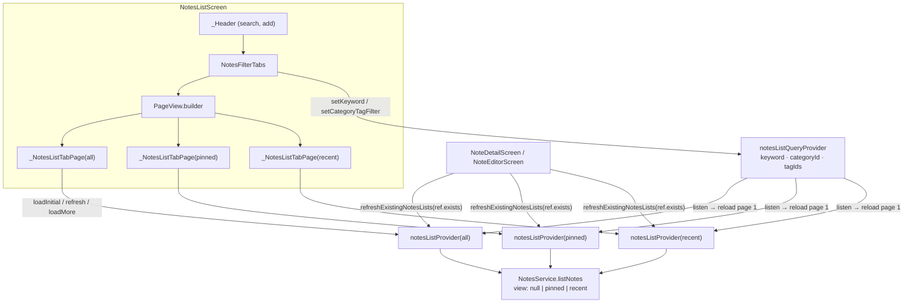

# Notes List Swipe Tabs

**Date:** 2026-07-25  
**Status:** Approved for planning (implemented)  
**Scope:** Home notes list — finger-following swipe between 全部 / 置顶 / 最近 while preserving per-tab list data and scroll position

## Goal

Users can switch view tabs by **tap** (tab row) or **horizontal swipe** (PageView). Each tab maintains its own paginated list state and scroll offset when revisited. Shared search and category/tag filters apply to all tabs without losing per-tab scroll/data.

## Background

- Prior to this feature, a single `notesListProvider` held one list; switching tabs called `setFilter` and replaced data in place (scroll reset).
- Category/tag filter (2026-07-23) already stacks `keyword`, `category`, and `tags` with `type=PUBLISHED` and optional `view` (pinned/recent).
- Tab row UI (`NotesFilterTabs`) and filter sheet remain unchanged in API; only list body and state ownership change.

## Decisions

| Topic | Choice |
|-------|--------|
| Pager | `PageView.builder` (3 pages: all → pinned → recent) |
| Tab highlight | Local `_activeTab` synced from `onPageChanged` and tab `onChanged` |
| Tab tap | `PageController.animateToPage` (300 ms, `easeOutCubic`) |
| List state | `NotifierProvider.family<NotesListNotifier, NotesListState, NotesFilterTab>` |
| Shared filters | `notesListQueryProvider` — keyword, categoryId, tagIds |
| Query → list | Each family notifier `watch` + `listen` on query; reload page 1 on change |
| Initial load | Screen calls `loadInitial()` on first frame per tab (not from notifier `build`) |
| Scroll / data retention | `_NotesListTabPage` + `AutomaticKeepAliveClientMixin` (`wantKeepAlive: true`) |
| Lazy tabs | Never-visited tabs skip fetch until first appear |
| Mutation refresh | `refreshExistingNotesLists(WidgetRef ref)` — `ref.exists` per tab, then `refresh()` |
| Helper signature | `WidgetRef` (widget call sites in detail/editor) |

## Interaction

1. **Fixed chrome:** Brand header, expandable search, add FAB row, and `NotesFilterTabs` (incl. filter icon) stay **outside** the pager.
2. **Swipe:** Horizontal drag on list area moves between tabs; tab row highlight follows.
3. **Tap tab:** Animates pager to the selected index; no refetch (data already loaded or lazy on first visit).
4. **Search / filter:** Writes to `notesListQueryProvider`; every **instantiated** tab notifier reloads page 1 with current query + its own `view`.
5. **Return visit:** Scroll position and loaded pages preserved via KeepAlive + family state.
6. **Pull-to-refresh:** Per tab page; failure toasts `UiStrings.notesRefreshFailed`, keeps existing items.
7. **Pin / delete / save:** Detail and editor call `refreshExistingNotesLists(ref)` so only visited tabs refresh.

## Architecture / data flow



### Shared query (`notes_list_query.dart`)

```dart
class NotesListQuery {
  final String keyword;
  final String? categoryId;
  final List<String> tagIds;
  bool get hasCategoryTagFilter => categoryId != null || tagIds.isNotEmpty;
}
```

`NotesListQueryNotifier`: `setKeyword`, `clearKeyword`, `setCategoryTagFilter` (no-op when unchanged).

### Per-tab list (`notes_list_notifier.dart`)

- Family arg `NotesFilterTab` maps to API `view`:
  - `all` → omit `view`
  - `pinned` → `NotesListView.pinned`
  - `recent` → `NotesListView.recent`
- `build()`: `ref.watch(notesListQueryProvider)` + `listen` → `_reloadOnQueryChange()` (skips initial emission and when `stateOrNull == null`).
- `_fetchGeneration` discards stale responses after rapid query/tab changes.
- `NotesListState` holds items/pagination/loading/error only — no duplicated query fields.

### Screen pages (`notes_list_screen.dart`)

- `_NotesListTabPage`: own `ScrollController`, load-more at 200 px from end, `RefreshIndicator`, empty/error/pinned-empty copy unchanged.
- Lazy gate: `page == 0 && items empty && !isInitialLoading && errorMessage == null` → one-shot `loadInitial()`.

### Refresh helper

```dart
Future<void> refreshExistingNotesLists(WidgetRef ref) async {
  for (final tab in NotesFilterTab.values) {
    if (ref.exists(notesListProvider(tab))) {
      await ref.read(notesListProvider(tab).notifier).refresh();
    }
  }
}
```

## Files

**Add**

- `lib/features/notes/notes_list_query.dart`

**Change**

- `lib/features/notes/notes_list_notifier.dart` — family provider, query listen, refresh helper
- `lib/features/notes/notes_list_state.dart` — remove query/tab fields from state
- `lib/features/notes/notes_list_screen.dart` — PageView.builder, KeepAlive tab pages
- `lib/features/notes/note_detail_screen.dart` — `refreshExistingNotesLists`
- `lib/features/notes/note_editor_screen.dart` — `refreshExistingNotesLists`

**Unchanged (API stable)**

- `lib/features/notes/widgets/notes_filter_tabs.dart` — `value` / `onChanged` / `onFilterTap` / `hasActiveFilter`
- `lib/features/notes/widgets/notes_filter_sheet.dart`

## Error handling

- Initial/replace fetch failure: empty state + error message + retry (`loadInitial`).
- Refresh failure: keep items, clear `isRefreshing`, toast refresh failed.
- Load-more failure: `loadMoreError` + footer retry button; prior pages kept.
- Stale fetch: generation counter; late responses ignored.

## Testing / verification (manual)

1. Swipe left/right between tabs; tab row highlight tracks finger release.
2. Tap tab animates pager; revisiting a tab restores scroll position.
3. 置顶 never visited → no network until first swipe/tap; then loads.
4. Search or apply filter → all **already visited** tabs reload; badge/filter icon behavior unchanged.
5. Pull-to-refresh on each tab independently.
6. Pin/delete/save from detail/editor refreshes only tabs user has opened this session.
7. Pinned empty state copy when no keyword; search empty uses search strings.

## Out of scope

- Shell bottom-navigation swipe
- Drafts tab swipe / multi-list
- Drift / Repository layer
- Persisting active tab index across app restarts
- Automated tests
- Client-side merge of tab lists

## Success criteria

1. Swipe and tap both switch tabs with synchronized tab row UI.
2. Each tab retains its own list pages and scroll offset when revisited.
3. Shared keyword/category/tag filters refetch all instantiated tab providers.
4. Post-mutation refresh updates visited tabs only, without eager-fetching unvisited tabs.
